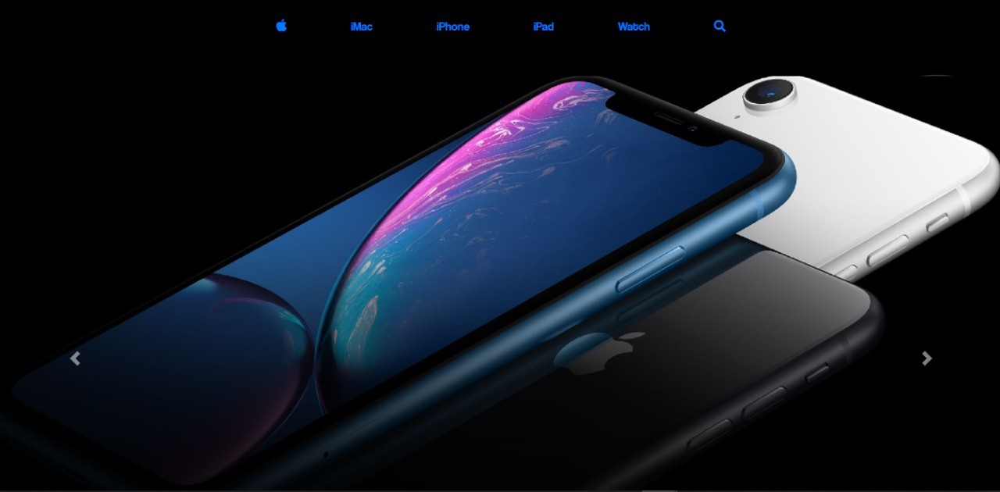
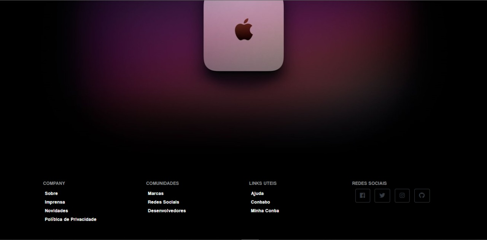
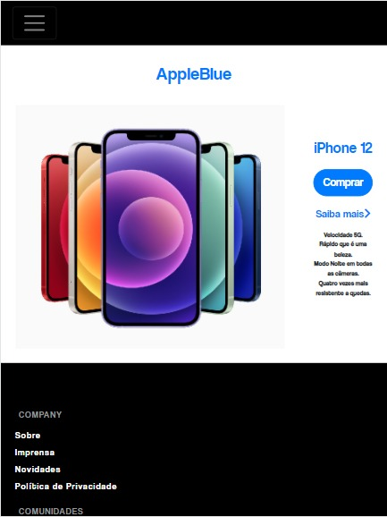

<h1 align="center">
  <span>Apple Blue</span>
</h1>

<p align="center">
  <a href="#-projeto">Projeto</a>&nbsp;&nbsp;&nbsp;|&nbsp;&nbsp;&nbsp;
  <a href="#-tecnologias-utilizadas">Tecnologias Utilizadas</a>&nbsp;&nbsp;&nbsp;|&nbsp;&nbsp;&nbsp;
  <a href="#-como-executar">Como executar</a>&nbsp;&nbsp;&nbsp;|&nbsp;&nbsp;&nbsp;
  <a href="#-licença">Licença</a>
</p>

<br>

<p align="center">
  

</p>

<br>

<p align="center">
  
  
  
</p>

<br/>
<br/>

## 💻 Projeto

O Apple Blue trata-se de uma inspiração no site da apple para venda dos seus produtos feito em html5, css3 e bootstrap puro. Utilizamos do conceito de responsividade e adaptamos para dispositivos Mobile. O projeto conta com apenas duas paginas para a visualização de todos os conceitos.

<br/>
<br/>

## ✨ Tecnologias utilizadas

Esse projeto foi desenvolvido com as seguintes tecnologias:

- [Html5](https://www.w3schools.com/html/)
- [Css3](https://www.w3schools.com/css/)
- [Bootstrap](https://getbootstrap.com/)

<br/>
<br/>

## 🚀 Como executar

- Basta baixar o projeto e rodar no live server do visual studio code.

**Clone o projeto**

```bash
  gh repo clone https://github.com/kaicLimaOliveira/AppleBlue.git

```
  


<br/>
<br/>

## 📄 Licença

Esse projeto está sob a licença MIT. Veja o arquivo [LICENSE](LICENSE) para mais detalhes.

---

<a href="https://kaicLimaOliveira.github.io">
 
 <br />
 <sub><b>Kaic de Lima Oliveira</b></sub></a>

Feito por Kaic de Lima Oliveira 👋🏽 Entre em contato!

[](https://www.facebook.com/kaic.oliveira.587) [](https://www.instagram.com/kaic.lo)
[](mailto:kaic10@outlook.com)
# Apple-Blue-Web
